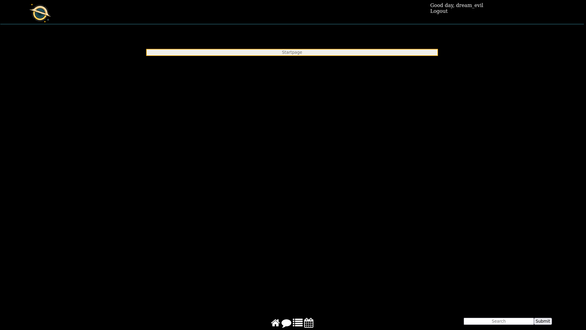
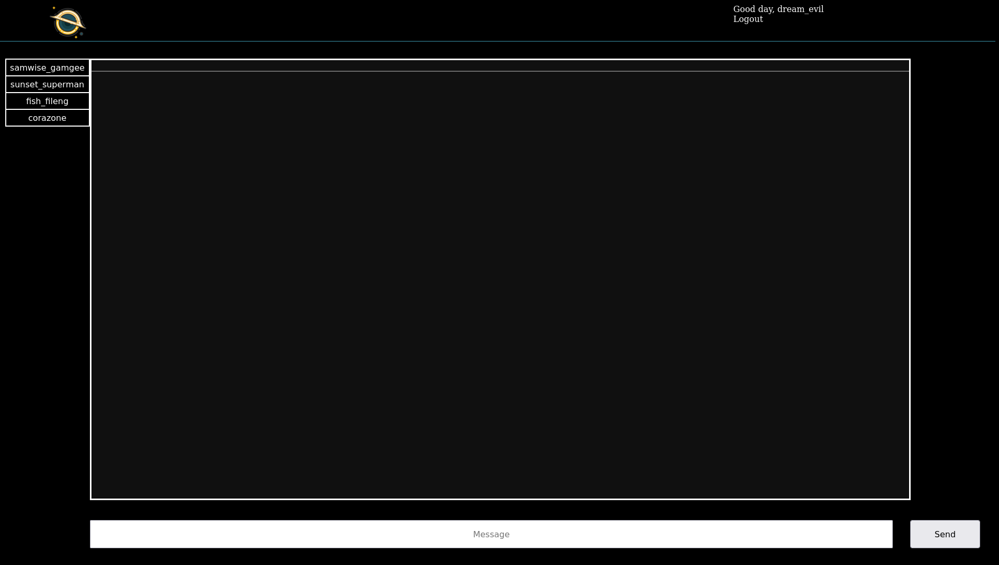
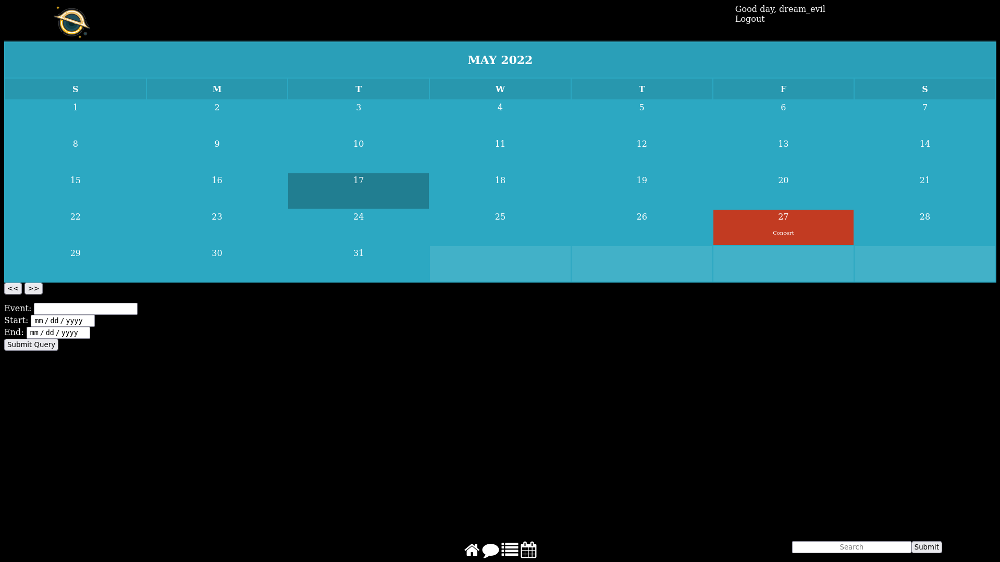
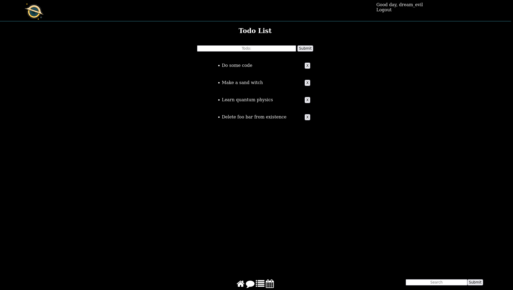

# Enigma

Social network/dashboard

    config -> database config files
    public -> contains all public files
    resources -> html, css, js, images...
    src -> source code directory, contains classes and rotues from inputs as well as db logic
    

